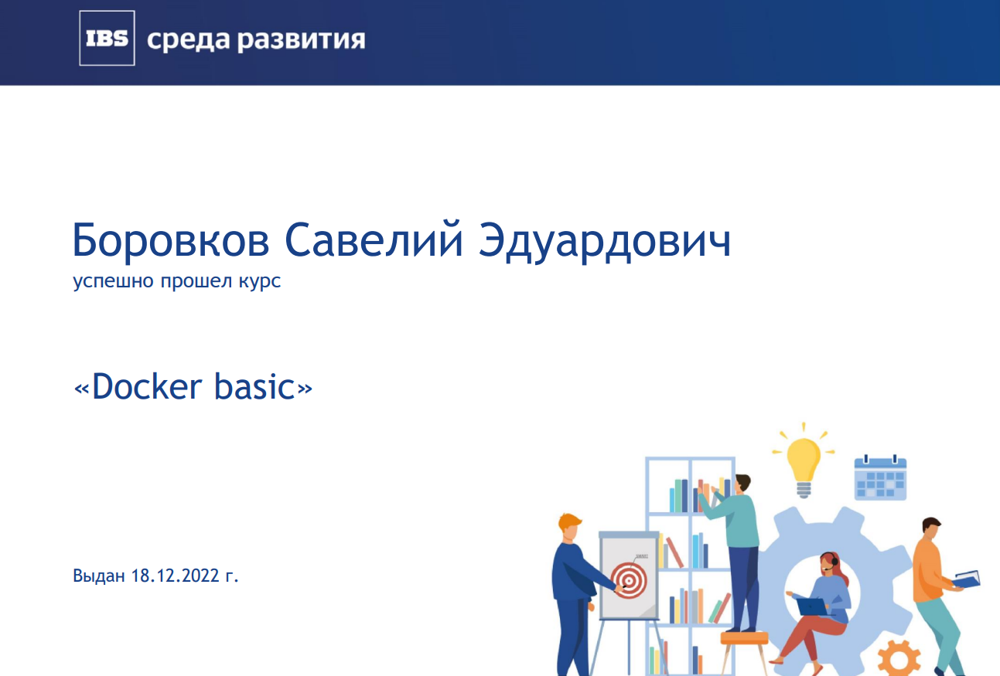
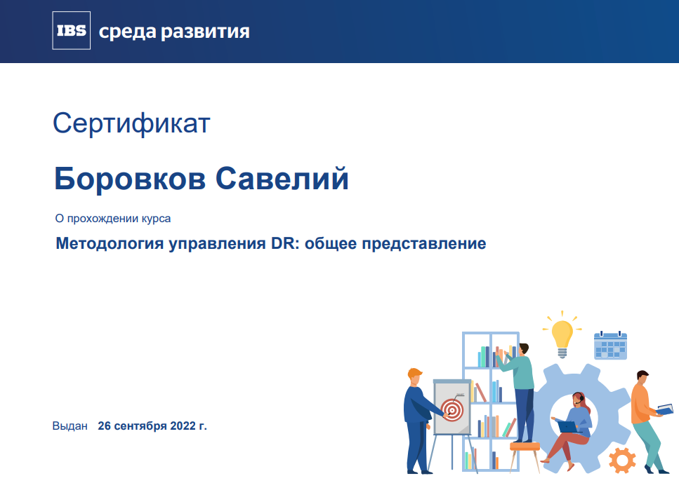
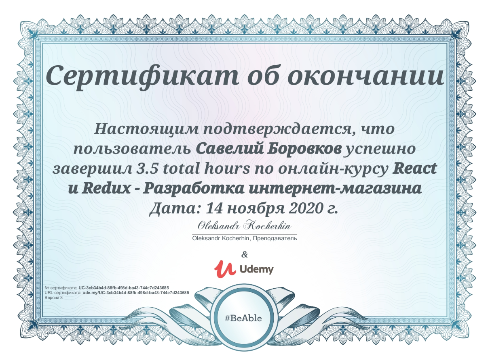
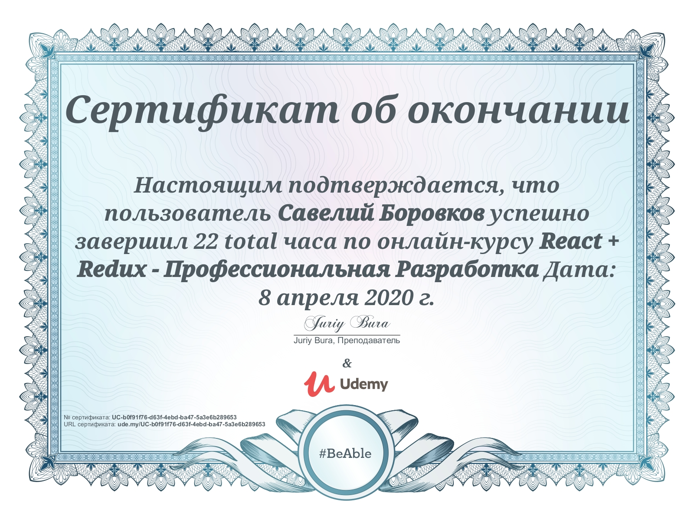
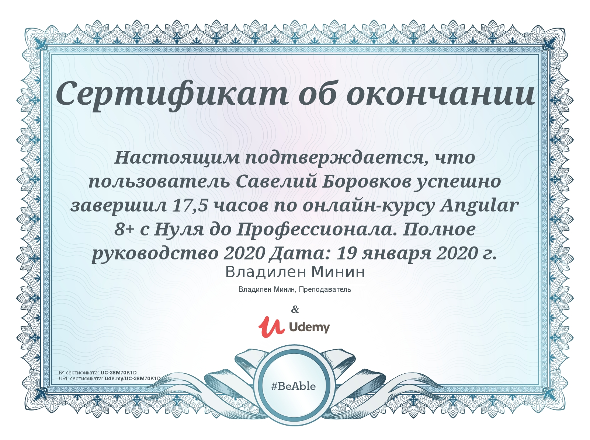
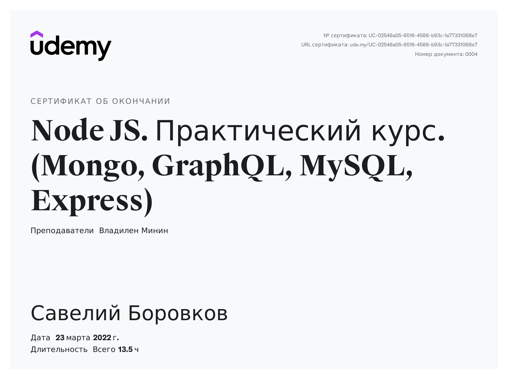

<h2> Hi there 👋, I'm Saveliy!

<p><em>Frontend developer </br>TeamLead

###  A little more about me...  

```js
const developer = {
  fullname: 'Saveliy Borovkov',
  country: 'Russia',
  Lenguages: [ 'RUS', 'EN' ],
  position: 'Frontend Developer',
  code: [ 'Javascript', 'Typescript', 'HTML', 'CSS' ],
  tools: [ 'Node', 'React', 'Redux', 'Angular', 'RxJs', 'NgRx', 'Jest', 'Docker', 'Webpack']
}
```
<h2> Certificates


###      
